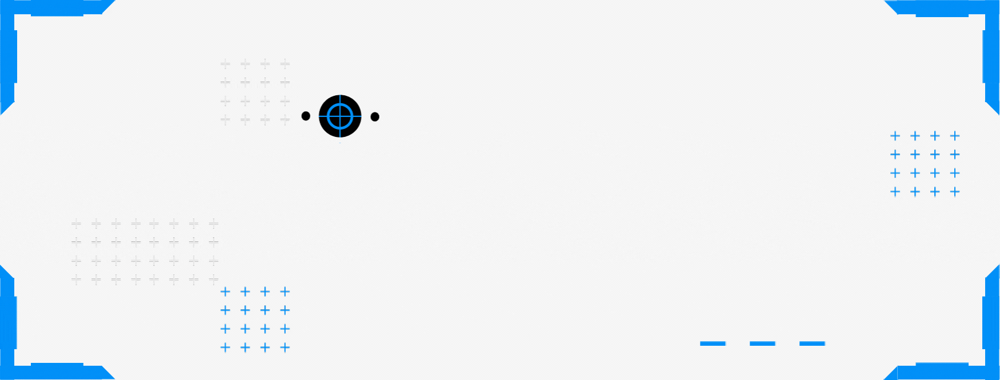
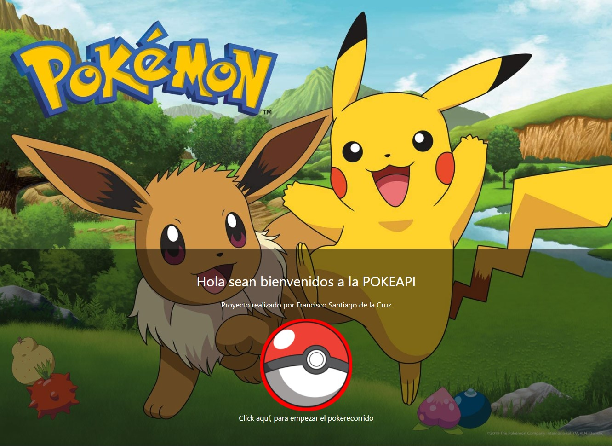
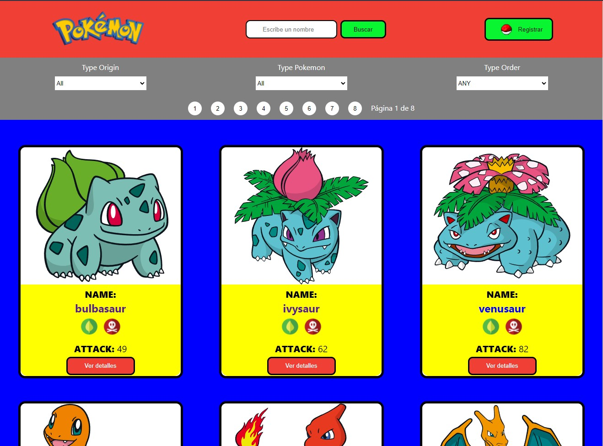
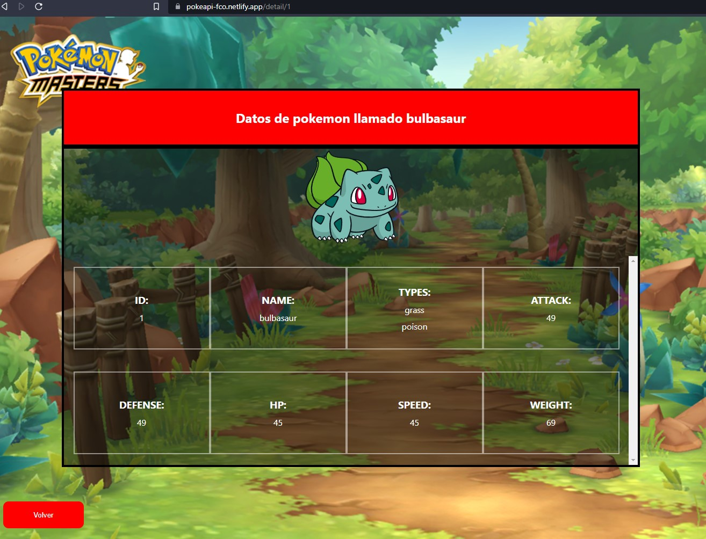
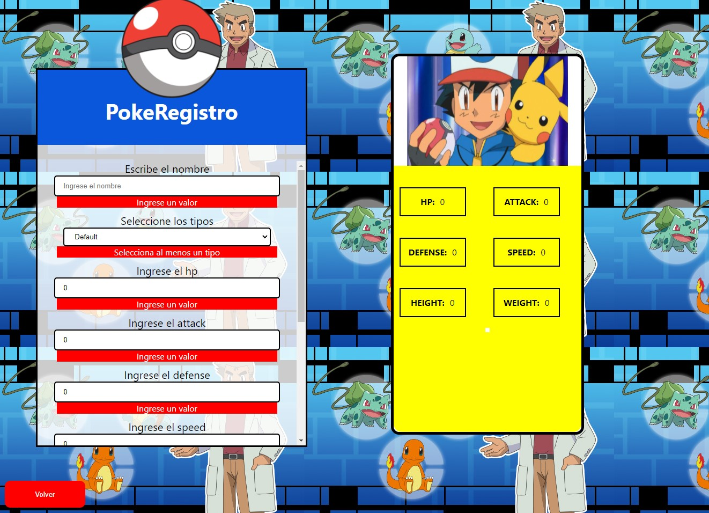

# Hola, Yo soy Francisco! 👋
## 🚀 Acerca de mi
Soy Desarrollador FullStack autodidacta, apasionado por la tecnología y con ganas de seguir aprendiendo. Me inicié en el mundo de la programación desde 2014, creando mi primera aplicación de escritorio utilizando Java, posteriormente ir adentrandome en nuevas tecnologías por curiosidad, con la intención de ir aprendiendo nuevas cosas.
Me considero una persona autodidácta, organizada y constante, a la que le gusta resolver problemas sin temor a enfrentarme a nuevos desafios.Actualmente me encuentro cursando un Bootcamp en SoyHenry, aprendiendo el uso de nuevas tecnologías como NodeJS, React, Redux, Expres, Sequalize

# 🛠 Skills
Desde mis estudios de preparatoria y la universidad he utilizado los siguientes lenguajes y herramientas:

        

# Proyectos

Actualmente me encuentro trabajando en un proyecto final en equipo para SoyHenry implementando la tecnología ágil de SCRUM, se trata de un ecommerce creado utilizando tecnologias como HTML, CSS, JS, REACT, REDUX, EXPRESS, SEQUELIZE y POSTGRESQL.

También se esta utilizando algunas librerias externas como son FONTAWESOME, AUTH0, SWEETALERT

## 1. Proyecto POKEAPI

#### Tecnologías usadas

- HTML5
- CSS3.
- JavaScript
- React
- Redux
- NodeJS
- PostgreSQL
- Sequelize
- Express

Realizado durante la etapa del Proyecto Individual en Henry, se trata de un SPA (single page aplication) para ver, buscar, filtrar y ordenar Pokemones obtenidos desde una API externa (pokeapi.co). Además de tener la posibilidad de crear su propio pokemón personalizado, desde un formulario controlado.

>Repositorio

# 🔗 ¿Como contactarme?

